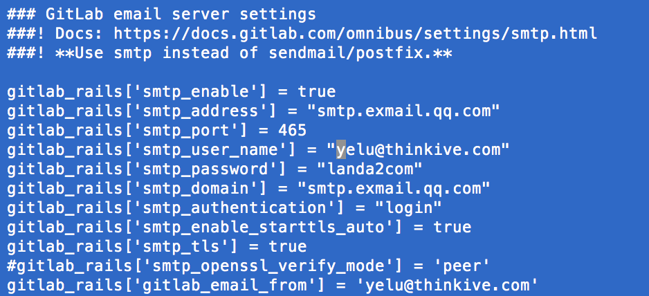
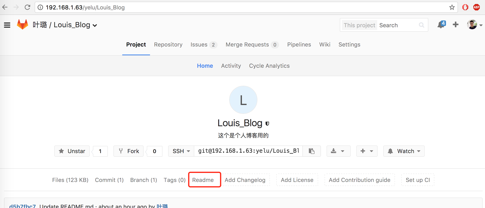
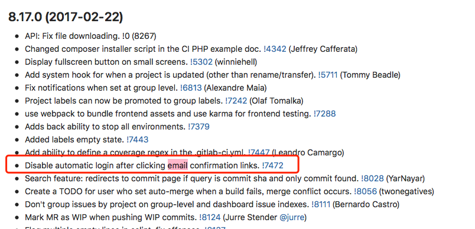
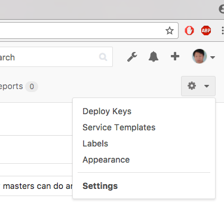
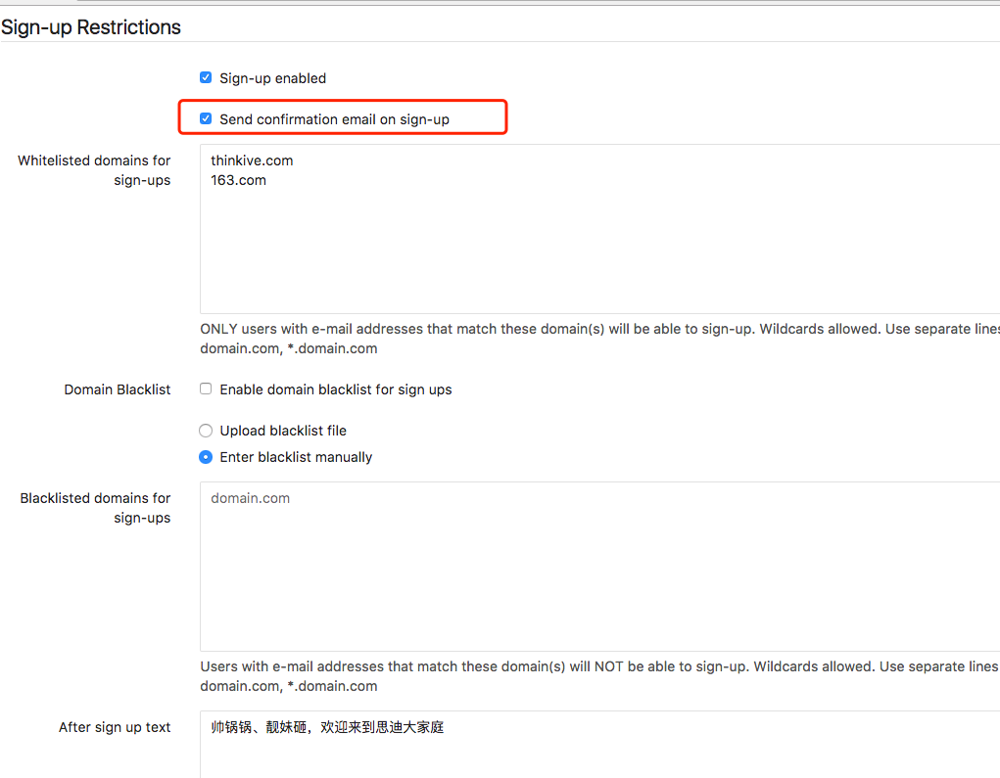

# 1.GitLab 安装及常见问题
本文参考：https://www.jianshu.com/p/4f8afc36a115?utm_source=oschina-app

## 1.1 为何上传头像失败
修改配置文件：

```swift
 cat /etc/gitlab/gitlab.rb，找到external_url把其域名修改成ip就可以
```


## 1.2 为何复制出来的git 地址是带域名的？然后自动添加到git管理器会失败
如图问题一修改配置就可以

## 1.3 gitlab 如何配置腾讯企业邮件
配置邮件的方法：https://docs.gitlab.com/omnibus/settings/smtp.html
记住修改脚本的时候，删除# 后不能前面留空格，其余按照教程做就可以
有一点必须注意：from 哪里必须写你发送邮件的邮件名称，然后用最后的测试发送邮件的方法测试发送邮件
配置：


命令汇总：

```swift
vi /etc/gitlab/gitlab.rb


测试发送邮件：
gitlab-rails console

输入：
Notify.test_email('yelu@thinkive.com', 'Message Subject', 'Message Body').deliver_now
```
效果：


## 1.4 gitlab 修改readeMe成base64 以后project都访问不了
打开project


选中ReadMe，然后删除就可以了



## 1.5 gitlab 如何查看版本：
需要登录以后才能查看：http://192.168.1.63/help，在首页


## 1.6 如何关联邮箱

```swift
vi /opt/gitlab/embedded/service/gitlab-rails/config/gitlab.yml
```
8.1.7.0 以后的版本取消了默认要求注册邮箱
https://gitlab.com/gitlab-org/gitlab-ce/blob/master/CHANGELOG.md




---
* Tips:

需要开启send confirmation email的功能才能收到注册邮件，需要关注project才能收到issues的邮件通知




## 1.7 gitlab设置自动备份
http://blog.csdn.net/qwer026/article/details/52066474

自动备份地址：

```
/var/opt/gitlab/backups
```
设置自动备份：

sudo su -
[crontab](http://www.cnblogs.com/peida/archive/2013/01/08/2850483.html) -e

1 1 * * * /opt/gitlab/bin/gitlab-rake gitlab:backup:create

```
这里设置是1点01分自动备份
```

## 1.8 gitlab 如何取消owner 权限

进入project menber，里面有个是否是owner的权限。


## 1.9.gitlab 有时候会报403 forbidden的错误
可以直接切换网络
可以修改gitlab的安全策略：

https://stackoverflow.com/questions/35994601/how-to-turn-off-rack-attack-in-gitlab-ce-omnibus/37437881#37437881

【gitlab使用】--gitlab-ce并发超过30引起ip被封
http://chuansong.me/n/2629829


## 1.10 gitlab 弄好以后sourceTree 连接会一直要求输入账号密码：
终端输入如下指令：把你的key添加到钥匙串中

```
ssh-add -K ~/.ssh/id_rsa_gitLab
```

## 1.11 gitlab 如何定时删除备份
没有找到，目前只能够手动删除

# 2.gitlab安装
安装环境：（https://docs.gitlab.com/ce/install/requirements.html）
系统内核：Red Hat 4.4.7-4 ,系统版本：CentOS release 6.5
查看系统内核命令：cat  /proc/version 或者 uname -a
查看系统版本命令:   cat  /etc/redhat-release

安装脚本：（https://about.gitlab.com/downloads/#centos6）
## 2.1. 安装和配置需要的工具
sudo yum install curl openssh-server openssh-clients postfix cronie

打开防火墙
sudo service postfix start
sudo chkconfig postfix on

sudo lokkit -s http -s ssh

```
sudo lokkit -s http -s ssh 会提示无法找到lokkit命令
 yum install lokkit，lokkit 可以帮助我们设定iptables 打开http和ssh
```
## 2.3.配置并启动 
sudo gitlab-ctl reconfigure

## 2.4. 浏览网页
直接输入服务器IP：192.168.1.63就可以，第一次启动时默认账户是root，进入后会要求修改密码，现在修改为thinkive

## 2.5.如果8080 端口被占用了，需要修改一下配置
修改配置文件：vi /etc/gitlab/gitlab.rb 
重配置：gitlab-ctl reconfigure 


Tips：
    1.访问网页报502错误
（官网修复方法：https://docs.gitlab.com/omnibus/common_installation_problems/README.html#tcp-ports-for-gitlab-services-are-already-taken）
    查看unicorn是否启动，如果报8080 in use就需要修改配置文件
    命令： gitlab-ctl tail unicorn 

查看当前gitlab运行状态：
sudo gitlab-ctl status


# 3.gitlab 检测升级

官网参考：
https://about.gitlab.com/update/
更新GitLab获取最新的特性。GitLab包含最新功能的版本会在每个月的22号发布。注意Gitlab升级的时候必须是同版本的，而且gitlab更新升级很快，如果你有一两年没有更新升级过，那么恭喜你了，你将会花费大量的时间用于更新升级，他不能跨大版本升级。

```
gitlab preinstall: It seems you are upgrading from 9.x version series
gitlab preinstall: to 11.x series. It is recommended to upgrade
gitlab preinstall: to the last minor version in a major version series first before
gitlab preinstall: jumping to the next major version.
gitlab preinstall: Please follow the upgrade documentation at https://docs.gitlab.com/ee/policy/maintenance.html#upgrade-recommendations
gitlab preinstall: and upgrade to 10.8 first.
错误：%pre(gitlab-ce-11.2.3-ce.0.el7.x86_64) 脚本执行失败，退出状态码为 1
Error in PREIN scriptlet in rpm package gitlab-ce-11.2.3-ce.0.el7.x86_64
gitlab-ce-9.3.0-ce.0.el7.x86_64 was supposed to be removed but is not!
  验证中      : gitlab-ce-9.3.0-ce.0.el7.x86_64                             1/2 
  验证中      : gitlab-ce-11.2.3-ce.0.el7.x86_64 
```
## 3.1.创建备份,备份文件默认路径：/var/opt/gitlab/backups 

```
sudo gitlab-rake gitlab:backup:create STRATEGY=copy
```

## 3.2.更新GitLab

```
sudo yum install -y gitlab-ce
```

# 4.gitlab 备份还原
## 4.1 备份
sudo gitlab-rake gitlab:backup:create
## 4.2 还原
sudo gitlab-ctl stop unicorn
sudo gitlab-ctl stop sidekiq

>  verify

sudo gitlab-ctl status

> This command will overwrite the contents of your GitLab database!
(要保证压缩包有足够的权限，我一般直接给777了,不知道为何拷贝过去的tar包就算权限一样，在新的服务器上还是不能解压，把权限修改成777就可以了)

sudo gitlab-rake gitlab:backup:restore BACKUP=1479433301

> restart and check Gitlab

sudo gitlab-ctl start
sudo gitlab-rake gitlab:check SANITIZE=true


# 5.gitlab 维护
## 5.1 日志相关production.log  操作的日志
/var/log/gitlab/gitlab-rails/production.log

## 5.2 检测gitlab当前服务状态
sudo -u git -H bundle exec rake gitlab:check RAILS_ENV=production SANITIZE=true

查看几种服务的启动状态
sudo gitlab-ctl status

```
run: nginx: (pid 972) 7s; run: log: (pid 971) 7s
run: postgresql: (pid 962) 7s; run: log: (pid 959) 7s
run: redis: (pid 964) 7s; run: log: (pid 963) 7s
run: sidekiq: (pid 967) 7s; run: log: (pid 966) 7s
run: unicorn: (pid 961) 7s; run: log: (pid 960) 7s
```

## gitlab 升级9.2.0 以后出现部分project访问404
最终的确认的原因，是因为我这个project是一个

```
Unable to save project. Error: Path Wikis is a reserved name
```
就是保留字段，然后通过下面的方法解决：

```
进入rail管理
sudo gitlab-rails console production

输入如下指令（复制粘贴）：
Project.where(path: 'Wikis').each do |project|
  if project.update_attributes(path: "#{project.path}0")
    project.rename_repo
  end
end
```

最后结果：

```
irb(main):034:0> Project.where(path: 'Wikis').each do |project|
irb(main):035:1*   if project.update_attributes(path: "#{project.path}0")
irb(main):036:2>     project.rename_repo
irb(main):037:2>   end
irb(main):038:1> end
Attempting to rename MobileApplicationDepartment_Android/Wikis -> MobileApplicationDepartment_Android/Wikis0
Attempting to rename MobileApplicationDepartment_iOS/Wikis -> MobileApplicationDepartment_iOS/Wikis0
=> [#<Project id: 10, name: "Wikis", path: "Wikis0", description: "问答归集、博客发布。。有你android更简单", created_at: "2017-04-12 08:05:47", updated_at: "2017-06-27 07:32:09", creator_id: 1, namespace_id: 18, last_activity_at: "2017-06-23 02:53:14", import_url: nil, visibility_level: 20, archived: false, avatar: "123123.png", import_status: "none", star_count: 1, import_type: nil, import_source: nil, import_error: nil, ci_id: nil, shared_runners_enabled: true, runners_token: "o_Gkj2MLKqtDxx-e5Eaz", build_coverage_regex: nil, build_allow_git_fetch: true, build_timeout: 3600, pending_delete: false, public_builds: true, last_repository_check_failed: false, last_repository_check_at: "2017-06-13 08:20:15", container_registry_enabled: true, only_allow_merge_if_pipeline_succeeds: false, has_external_issue_tracker: false, repository_storage: "default", request_access_enabled: false, has_external_wiki: false, lfs_enabled: nil, description_html: "<p dir=\"auto\">问答归集、博客发布。。有你android更简单</p>", only_allow_merge_if_all_discussions_are_resolved: false, printing_merge_request_link_enabled: true, auto_cancel_pending_pipelines: 1, import_jid: nil, cached_markdown_version: 1, last_repository_updated_at: nil>, #<Project id: 7, name: "Wikis", path: "Wikis0", description: "这里用于存放所有分享的wiki", created_at: "2017-04-11 03:08:36", updated_at: "2017-06-27 07:32:14", creator_id: 1, namespace_id: 14, last_activity_at: "2017-06-23 09:24:51", import_url: nil, visibility_level: 20, archived: false, avatar: nil, import_status: "none", star_count: 5, import_type: nil, import_source: nil, import_error: nil, ci_id: nil, shared_runners_enabled: true, runners_token: "GCbzJfyt4DuNxKRpfYS6", build_coverage_regex: nil, build_allow_git_fetch: true, build_timeout: 3600, pending_delete: false, public_builds: true, last_repository_check_failed: false, last_repository_check_at: "2017-06-12 04:20:16", container_registry_enabled: true, only_allow_merge_if_pipeline_succeeds: false, has_external_issue_tracker: false, repository_storage: "default", request_access_enabled: true, has_external_wiki: false, lfs_enabled: true, description_html: "<p dir=\"auto\">这里用于存放所有分享的wiki</p>", only_allow_merge_if_all_discussions_are_resolved: false, printing_merge_request_link_enabled: true, auto_cancel_pending_pipelines: 1, import_jid: nil, cached_markdown_version: 1, last_repository_updated_at: "2017-06-23 09:24:51">]
irb(main):039:0> quit

```

参考官网文档：https://gitlab.com/snippets/34363（作者：Dmitriy Zaporozhets ，Ruby developer, GitLab CTO，乌克兰小伙）

排查过程：刚开始一脸懵逼不知道咋回事，然后从404 开始找，然后看到维护，然后想办法看日志，然后无意间看到一个日志有关系，然后查找提示无route，然后无意间又发现一个rename project的方法，但是不知道跟我的有什么关系，然后又继续，再然后不知道在那看到了一个reserved 单词，查了一下发现是保留字，突然就明白了，我的工程是因为是github的保留字段所以不能访问了。接下来就是修改工程名字就可以。

期间绕了一个大弯：
1.日志其实就有提示错误信息，但是没有细看
2.不知道什么日志有什么作用
3.看了别人提供的方法，但是不知道怎么用，看了例子也猜错用法了


# 6.gitlab 工具集介绍：
rails:ruby的开发框架
unicorn:HTTP服务器，应该就是整个gitlab网页是否能访问的基础了
redis:日志存储系统（数据库）
postgresql:数据库
nginx:点子邮件代理web服务器
Sidekiq：后台运行的监听异常故障的工具。
介绍：https://docs.gitlab.com/ee/administration/troubleshooting/sidekiq.html

```
Sidekiq is the background job processor GitLab uses to asynchronously run tasks. When things go wrong it can be difficult to troubleshoot. These situations also tend to be high-pressure because a production system job queue may be filling up. Users will notice when this happens because new branches may not show up and merge requests may not be updated. The following are some troubleshooting steps that will help you diagnose the bottleneck.
```

# 7.gitlab 日志文件介绍：
文件目录；/var/log/gitlab/gitlab-rails/

* githost.log （没有日志，应该是别的主机访问的记录吧）
* production.log（好像系统的错误日志）
* gitlab-rails-db-migrate-2017-06-23-12-34-06.log（migrate（迁移不是合并哦）的日志）
* application.log  (创建、修改删除工程的日志)


## 7.1 查看日志的方式

```
# 查看所有的logs; 按 Ctrl-C 退出
sudo gitlab-ctl tail

# 拉取/var/log/gitlab下子目录的日志
sudo gitlab-ctl tail gitlab-rails

# 拉取某个指定的日志文件
sudo gitlab-ctl tail nginx/gitlab_error.log
```

# 8 GitLab版本

## 8.1 两个版本
分CE（Community Edition 社区版本）和EE（Enterprise Edition企业版本）
## 8.2 区别：
https://about.gitlab.com/installation/ce-or-ee/?distro=centos-6

## 8.3 两者的安装方法类似但是不同
https://about.gitlab.com/installation/#centos-6

1.安装和配置依赖包

```
以下命令会打开HTTP和SSH在系统防火墙的访问权限
EE：
sudo yum install -y curl policycoreutils-python openssh-server cronie 
CE：
sudo yum install -y curl policycoreutils-python openssh-server openssh-clients cronie 


sudo lokkit -s http -s ssh 
```

2.安装邮件发送软件[postfix](https://baike.baidu.com/item/Postfix/10077421)    

```
sudo yum install postfix
sudo service postfix start 
sudo chkconfig postfix on 
```
3.添加GitLab包依赖和下载并安装包（这里CE和EE不一样）

```
EE：
添加包依赖
curl https://packages.gitlab.com/install/repositories/gitlab/gitlab-ee/script.rpm.sh | sudo bash 

sudo EXTERNAL_URL="http://192.168.90.155" yum -y install gitlab-ee 

CE：
添加包依赖
curl -sS https://packages.gitlab.com/install/repositories/gitlab/gitlab-ce/script.rpm.sh | sudo bash 

sudo EXTERNAL_URL="http://192.168.90.155" yum install -y gitlab-ce 
```

# 9.如何更新清华源

安装的时候提示网络链接失败或者很慢，所以还是用国内做的镜像，目前有清华大学的还有浙江大学的，经过测试清华大学（https://mirror.tuna.tsinghua.edu.cn/help/gitlab-ce/）的目前访问不了，浙江大学（http://mirrors.zju.edu.cn），具体使用方法：

## 9.1.新建 /etc/yum.repos.d/gitlab_gitlab-ce.repo，内容为:
网上很多人文件名都瞎写成gitlab-ce.repo，自己没有实践过，实际上他们写的文件名不全

```
[gitlab-ce]
name=gitlab-ce
baseurl=http://mirrors.tuna.tsinghua.edu.cn/gitlab-ce/yum/el7
repo_gpgcheck=0
gpgcheck=0
enabled=1
gpgkey=https://packages.gitlab.com/gpg.key
```

其中baseurl 的规则，那个el$ 中的$ 要修改成e16或者e17（网上很多人都瞎写，都直接用别人的配置，都不知道他们怎么成功的，这个不改是不能用的） ，它是不同的目录，但是有相同的内容，如果这里不指定，则访问失败，想要验证路径是否正确，只需要把url放到浏览器中看是否能访问到即可


## 9.2. 执行命令下载

```
将服务器上的软件包信息 现在本地缓存,以提高 搜索 安装软件的速度
sudo yum makecache
注意：执行上面这句脚本前要先将gitlab_gitlab-ee.repo 先改后缀保存起来，否则缓存的时候会执行gitlab_gitlab-ee.repo里面的脚本，这里本来就是跑不同的，会浪费很多时间

安装gitlab-ce，默认装最新的
sudo yum install gitlab-ce
如果要指定版本：
sudo yum install gitlab-ce-9.3.0-ce.0.el7.x86_64
```

如果以上方法还是装不了，就直接在gitlab提供的page中点击对应的安装包，他会跳转到安装页面中，按照他的安装方式安装即可
https://packages.gitlab.com/gitlab/gitlab-ce


# 10. 不小心装成了EE，如果弄回CE？
没有找到是否可以共用的理论依据，但是想着数据库啥的都是用的同一个，应该不能共用，只能卸载了。但是没有在官网上找到官方的卸载的,有个官网参考：https://gitlab.com/gitlab-org/omnibus-gitlab/issues/135，有个民间参考：https://www.jianshu.com/p/4dd47d1f1c76
1.sudo gitlab-ctl stop
2.gitlab-ctl uninstall
3.sudo rpm -e gitlab-ce
4.杀死所有gitlab守护进程runsvdir
5.删除所有gitlab文件
find / -name gitlab|xargs rm -rf      删除所有包含gitlab的文件及目录
6.删除备份文件，root目录下


# 11.sudo gitlab-ctl reconfigure 卡死
参考：https://blog.csdn.net/u010837612/article/details/78909545
解决：sudo systemctl restart gitlab-runsvdir （启动gitlab守护进程）
再执行：sudo gitlab-ctl reconfigure

# 12.El6，EL7区别，EL跟OL的区别，下载RPM包时会用到
EL是RedHatEnterpriseLinux的简写-EL6软件包用于在RedHat6.x,CentOS6.x,andCloudLinux6.x进行安装-EL5软件包用于在RedHat5.x,CentOS5.x,CloudLinux5.x的安装-EL7软件包用于在RedHat7.x,CentOS7.x,andCloudLinux7.x的安装


ol具体是什么系统我不是很清楚，ol通常是oracle enterprise linux，这个是美国oracle公司以红帽为基础编译的一个linux发行版。它除了具有红帽系统的内核，自己还有一套据称是坚不可摧的内核。当然，是不是真的那么结实只有天知地知了。


