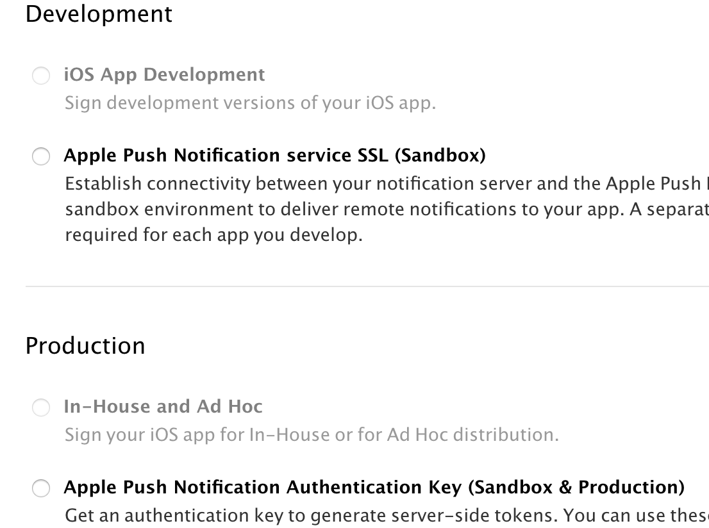
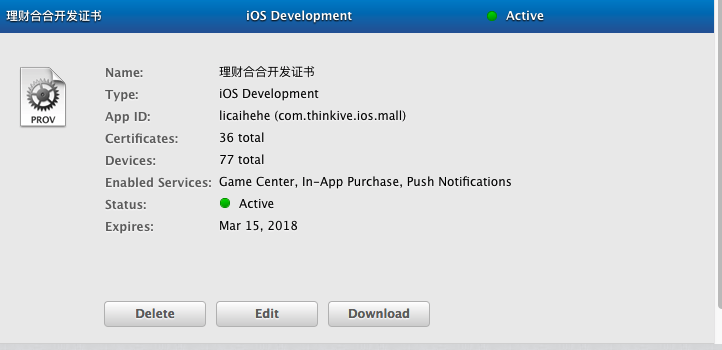
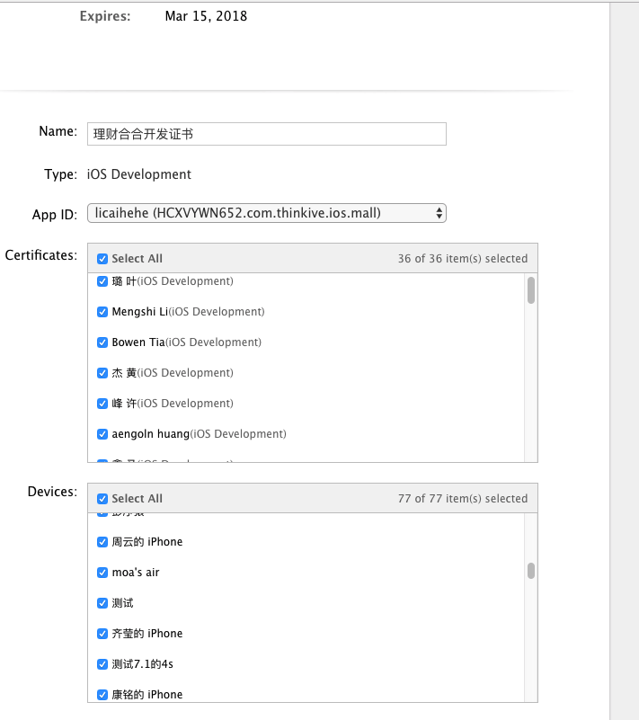
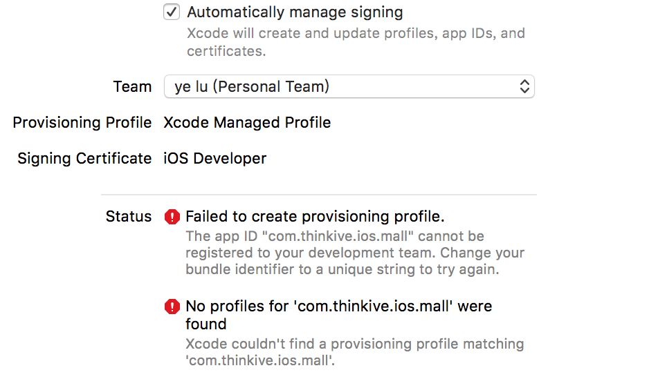
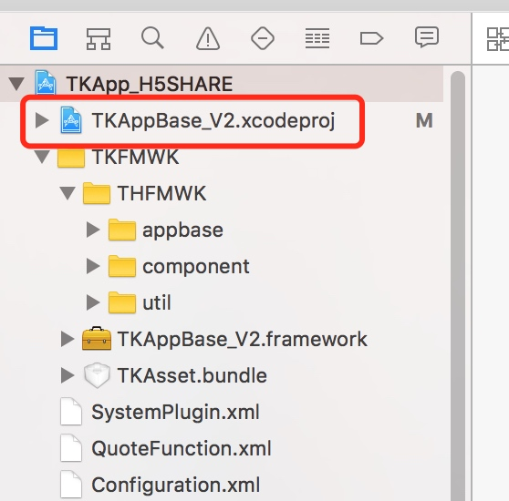

# 1.证书配置页面说明／ 证书相关
安装的证书文件的路径：

```
/Users/apple/Library/MobileDevice/Provisioning Profiles
```

## 1.1.Xcode证书配置页面介绍
Tips：子账号没有证书管理的权限，修改描述文件的权限也没有
> Team
 
* 个人的（personal  只要申请了苹果账号的都会有一个personal team，这个personal的可以用来做真机调试，他所生成的证书不会在管理中心中显示，而且6天过期）

<image src="media/14987234669123.png" width="500" height="300" alt="图片名称" align=center/>

* 企业的 一般勾选这个后会自动匹配证书

> Signing Certificate：

签名证书，对应的mobileprovision

开启 Automatically manage signing 后会发生的事情：
1.是不是会自动创建证书？会用你的xcode 创建一个。certificates 是证书的意思，每个有子账号的都能添加上去？是的，而且是自动的，搜邀请成功后用auto 设置，，过一个小时就有了


2.如果证书存在的话，还会不会创建证书？应该是直接用创建好的证书



为何这里都不能添加证书了，用xcode却可以？子账号可以，系统自己加的，不能手动加


provisioning profiles ：证书介绍，







code-signing identity：数字签名标识：

有个经验：先选择Provisioning Profile的文件以后，code-signing identity里面的东西才能够选择


Provisioning Profile也叫PP文件
一个Provisioning Profile文件包含了上述的所有内容：证书、App ID、设备。

试想一下，如果我们要打包或者在真机上运行一个应用程序，我们首先需要证书来进行签名，用来标识这个应用程序是合法的、安全的、完整的等等；然后需要指明它的App ID，并且验证Bundle ID是否与其一致；再次，如果是真机调试，需要确认这台设备能否用来运行程序。而Provisioning Profile就把这些信息全部打包在一起，方便我们在调试和发布程序打包时使用，这样我们只要在不同的情况下选择不同的profile文件就可以了。而且这个Provisioning Profile文件会在打包时嵌入.ipa的包里。


例如，如下图所示，一个用于Development的Provisioning Profile中包含了该Provisioning Profile对应的App ID，可使用的证书和设备。这意味着使用这个Provisioning Profile打包程序必须拥有相应的证书，并且是将App ID对应的程序运行到Devices中包含的设备上去。


IOS开发证书和授权文件说明  


一、成员介绍
1.    Certification(证书)

证书是对电脑开发资格的认证，每个开发者帐号有一套，分为两种：

1)    Developer Certification(开发证书)

安装在电脑上提供权限：开发人员通过设备进行真机测试。

可以生成副本供多台电脑安装；

2)      Distribution Certification(发布证书)

安装在电脑上提供发布iOS程序的权限：开发人员可以制做测试版和发布版的程序。

不可生成副本，仅有配置该证书的电脑才可使用；（副本制做介绍在下面Keychain中介绍）


2.    Provisioning Profile(授权文件)

授权文件是对设备如iPod Touch、iPad、iPhone的授权，文件内记录的是设备的UDID和程序的App Id，即使被授权的设备可以安装或调试Bundle identifier与授权文件中记录的App Id对应的程序。

开发者帐号在创建授权文件时候会选择App Id，（开发者帐号下App Id中添加，单选）和UDID（开发者帐号下Devices中添加最多100个，多选）。

授权文件分为两种，对应相应的证书使用：

1)    Developer Provisioning Profile(开发授权文件)

在装有开发证书或副本的电脑上使用，开发人员选择该授权文件通过电脑将程序安装到授权文件记录的设备中，即可进行真机测试。

注意：确保电脑有权限真机调试，即安装了开发证书或副本；在开发工具中程序的Bundle identifier和选中使用的授权文件的App Id要一致；连接调试的设备的UDID在选中的授权文件中有记录。

2)    Distribution Provisioning Profile(发布授权文件)

在装有发布证书的电脑上（即配置证书的电脑，只有一台）制做测试版和发布版的程序。

发布版就是发布到App Store上的程序文件，开发者帐号创建授权文件时选择store选项，选择App Id，无需选择UDID；

测试版就是在发布之前交给测试人员可同步到设备上的程序文件，开发者帐号创建授权文件时选择AdHoc，选择App Id和UDID；只有选中的UDID对应的设备才可能安装上通过该授权文件制做的程序。

3.    Keychain(开发密钥)

安 装证书成功的情况下证书下都会生成Keychain，上面提到的证书副本就是通过配置证书的电脑导出Keychain（就是.p12文件）安装到其他机子 上，让其他机子得到证书对应的权限。Developer Certification就可以制做副本Keychain分发到其他电脑上安装，使其可以进行真机测试。

注意：Distribution Certification只有配置证书的电脑才可使用，因此即使导出导出Keychain安装到其他电脑上，其他电脑也不可能具有证书的权限。


# 2.framework 包如何适配arc还是mrc？

在Build Phases -> Compile Sources 中所有文件都加上他们的编译类型，Arc和非ARC都需要添加上标识，这样在MRC和ARC环境中他们都会根据你的配置选择对应的编译方式，如果不写则按照默认的模式来，如我们的默认是ARC，我们不配置ARC的选项，就会按照ARC的来编译，但是如果放到MRC下这个就会有内存泄漏了。


# 3.如何调适FrameWork
1.保证你原来的工程能够跑
2.保证你原来工程用的库和你需要调试的framework是一套
3.在你原来工程中建立一个Untitled.xcworkspace
4.添加你原来的工程
5.在你原来的工程的子目录中添加你的framework工程


6.运行调试

 7.如果不行，可以试试添加Target Dependencies
## 4. $(inherited) 的作用
 此处的Xcode中的（搜素头文件的路径中的参数值中的）inherited
 
 参考：https://www.crifan.com/xcode_inherited_meaning/


